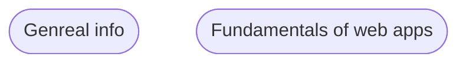
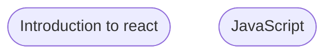
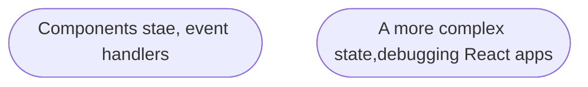

# FullStackOpen

### Part 0

```mermaid
    flowchart TD
    id1([Genreal info]) 
    id2([Fundamentals of web apps])
```

### part 1

```mermaid
    flowchart
    id1([Introduction to react]) 
    id2([JavaScript])
```

```mermaid
    flowchart
    id1([Components stae, event handlers]) 
    id2([A more complex state,debugging React apps])
```
